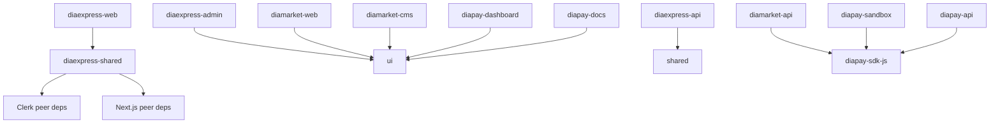

# Monorepo architecture

## Workspace map

```text
apps/
  diamarket-web        # DiaMarket storefront
  diamarket-cms        # DiaMarket CMS
  diamarket-api        # DiaMarket API
  diapay-dashboard     # DiaPay dashboard
  diapay-docs          # DiaPay documentation
  diapay-sandbox       # DiaPay sandbox
  diapay-api           # DiaPay API
  diaexpress-web       # DiaExpress public/client Next.js app
  diaexpress-admin     # DiaExpress admin Next.js app
  diaexpress-api       # DiaExpress Express/MongoDB API
packages/
  ui                   # shared UI primitives
  config               # shared config helpers
  eslint-config        # shared lint config
  tsconfig             # shared TypeScript config package
  diapay-sdk-js        # DiaPay JavaScript SDK
  diaexpress-shared    # DiaExpress auth/API/UI/pages utilities
  diamarket-shared     # reserved DiaMarket shared surface
```

## Dependency rules



- Apps may depend on packages through workspace package names only.
- Apps must not import files from another app directory.
- Shared code that is used by more than one app belongs in `packages/*`.
- Package exports are the contract for app imports; hidden relative paths to package internals are not allowed.
- DiaExpress shared code builds to `dist/` and declarations to `dist-types/` before the DiaExpress web build.

## Build and deployment

- DiaExpress web runs `pnpm --filter @diaexpress/shared build && next build` so the package contract is built before Next.js resolves package exports.
- Turborepo still keeps package order with `dependsOn: ["^build"]` for global builds.
- Each app keeps its own `package.json`, `.env.example`, app config, and start/build scripts for Render/Vercel monorepo deployments.
